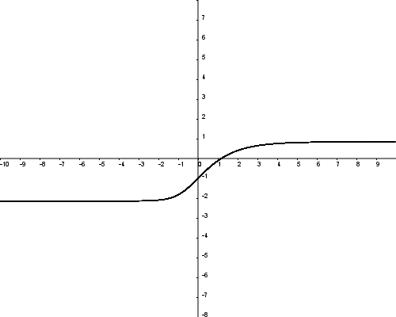

# Numerical Plotter for Functions (JavaScript Version)

This project is a browser-based tool for plotting mathematical functions and solving numerical equations using JavaScript. It leverages web technologies to create interactive and visually appealing plots.

---

## **Features**

### **1. Basic Function Plotting**  
- Supports graphing standard mathematical functions like:  
  - e^x   (Exponential)  
  - sin(x)   (Sine)  
  - Other user-defined functions.  

### **2. Partial Differential Equations (PDEs)**  
- Numerically solves and visualizes complex PDEs.  
- Example PDE:  
  -y" = yy' + (y')^2   

### **3. System of Equations**  
- Simulates dynamic systems, such as:  
  - **Runner and Chaser System**: Demonstrates how two entities interact with predefined movement rules.  

---

## **Technical Details**

- **Built with JavaScript**: Enables execution directly in the browser without requiring additional software.  
- **Data Visualization**:  
  - Uses libraries like **canvas.js** for high-quality and interactive graphing.  
- **Numerical Solvers**:  
  - Implements numerical integration techniques for solving differential equations.  

---

## **Usage**

### **1. Setup**  
- run the following command
```cmd
npm install
```
---

## **Output Examples**

- **Basic Function**: A graph of (y = sin(x)) over a user-defined range.  
- **PDE Solution**: A numerical plot of the solution to (-y") = yy' + (y')^2.  
- **System of Equations**: Trajectories of the runner and chaser as they interact dynamically.
  
(-y") = yy' + (y')^2 <br>


---

## **Future Enhancements**

1. **Real-time Input Validation**:  
   - Provide feedback if the user enters an invalid equation or unsupported syntax.  

2. **Drag-and-Drop Interface**:  
   - Allow users to upload pre-defined equation files for easier access.  

3. **Export Options**:  
   - Enable users to download the plots as images or CSV data files.  

4. **Advanced Solvers**:  
   - Support for finite element methods for more complex equations.  

5. **3D Plotting**:  
   - Extend functionality to visualize functions and systems in 3D space.  

This JavaScript-based numerical plotter offers an interactive and efficient way to explore mathematical functions, differential equations, and dynamic systems!
