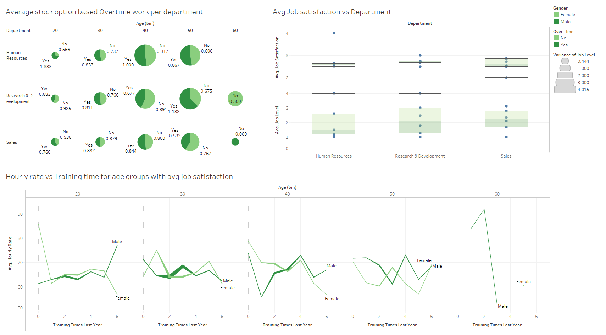

# Basic Details

- Make sure the analysis.py and analysis.ipynb files are in the same directory as the dataset WA_Fn-UseC_-HR-Employee-Attrition.csv

- analysis.ipynb file contains a sample run showcasing each output and graphs.
- analysis.py can be run and will create popup graph windows.

- before running either files make sure the requirements are fulfilled by first running `pip install -r requirements.txt`

- IBM_HR_Analytics.twb is the tableau file
- IBM_HR_Analytics.png is the image of the tableau dashboard

- **kaggle link**: https://www.kaggle.com/code/darsh22blc1378/attrition-prediction-complete-comparitive-study

# Tableau Analysis Dashboard

