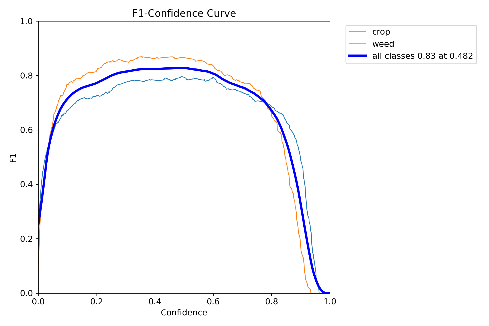
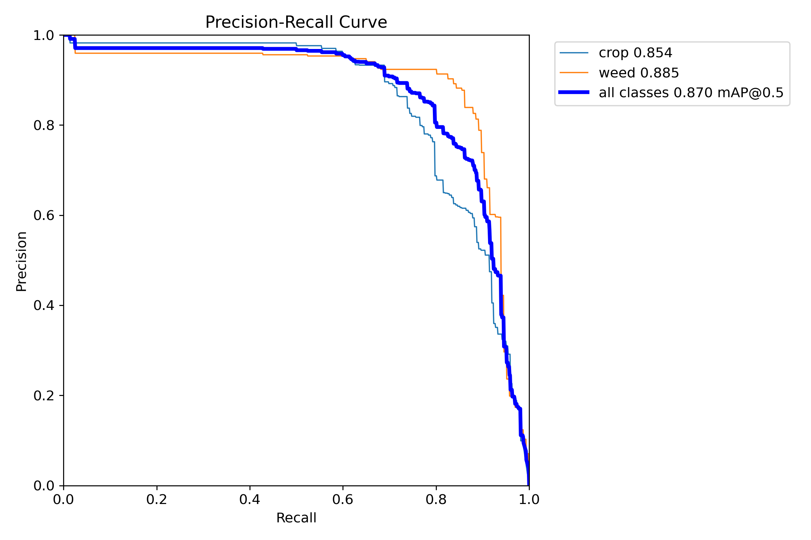
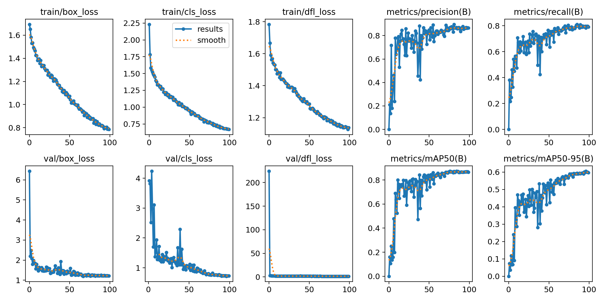
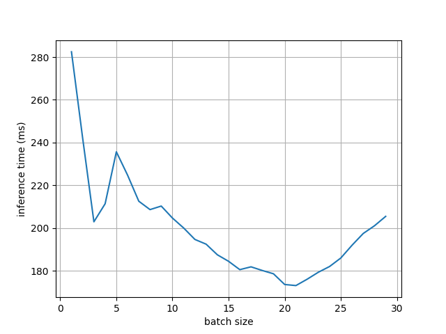
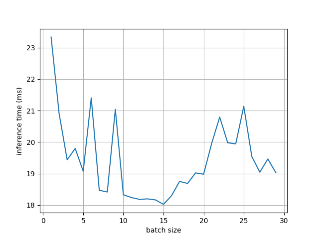

# Plant Weed and Disease Detection  

## Abstract  
The advancement of drone technology has opened up new opportunities for precision agriculture, enabling efficient monitoring and management of agricultural fields. This study introduces a new method that utilizes the YOLOv8 model to detect and classify weeds and diseases in agrarian fields using aerial images captured by drones. The model was trained on a batch size of 32 for 40 to 100 epochs, and the hyperparameters were fine-tuned to get optimal performance. This resulted in a precision of 87% and a recall of 80% for weed detection and 60% precision and 43% recall for disease detection. The results indicate the potential of drone-based weed and disease detection as a valuable tool for farmers and agronomists to gather accurate, timely, and comprehensive data about their fields, facilitating informed decision-making and precise management practices. By leveraging the advantages offered by drones, farmers have the opportunity to enhance the efficiency of resource allocation, increase crop productivity, ensure food security, minimize their ecological footprint, and actively contribute to long-term sustainability farming methods that preserve natural resources for future generations.  

This project addresses the challenge of detecting weeds and diseases in agricultural fields using drone-captured images. By leveraging the YOLOv8m model, it aims to provide efficient and accurate detection, aiding farmers in timely decision-making for crop management.  

### DOI  
You can find the published research paper here: [IEEE DOI](https://doi.org/10.1109/CICT59886.2023.10455507)  

---

## Key Details  

- **Model Used:** YOLOv8m  
- **Optimizer:** Adam (learning rate: 0.01)  
- **Batch Size:** 15  

---

## File Structure  

```
Weed_detector/  
|  ├── F1_curve.png              # F1 score curve image  
|  ├── PR_curve.png              # Precision-Recall curve image  
|  ├── results.png               # General results visualization  
|  ├── results.csv               # Detailed results in CSV format  
├── DRONE-BASED WEED AND DISEASE DETECTION IN AGRICULTURAL FIELDS _ A YOLOv8 ALGORITHM APPROACH.pdf  
├── fig_cpu.png               # Inference time vs batch size (CPU)  
├── fig_gpu.png               # Inference time vs batch size (GPU)  
├── Yolo_model.py             # YOLOv8 model implementation  
└── README.md                 # Documentation (this file)  
```  

---

## Optimizations  

The model has been optimized for inference on both **CPU (Intel i5 12th Gen)** and **GPU (Nvidia RTX 2050)**.  

### Batch Size Impact  

- Batch size was tuned to achieve the best trade-off between performance and inference speed.  
- Plots for CPU and GPU inference times against batch sizes are provided (`fig_cpu.png` and `fig_gpu.png`).  

---

## Performance Metrics  

1. **F1 Curve**  
     
   This illustrates the F1 score variation across confidence thresholds.  

2. **Precision-Recall Curve**  
     
   This curve shows the relationship between precision and recall for different confidence levels.  

3. **General Results**  
     
   Visualizations of the model's output on sample images.  

4. **Detailed Results**  
   - Results including precision, recall, and F1 scores for each class are stored in `results.csv`.  

---

## Inference Time  

Inference performance was measured on both CPU and GPU platforms, and results were plotted against different batch sizes.  

- **CPU Inference Time**  
     

- **GPU Inference Time**  
     

---

## How to Run the Code  

1. Run the YOLOv8 model script:  
   ```bash  
   python Yolo_model.py  
   ```  

2. Results will be stored in `results/` and visualizations will be saved in the root folder.  

---

## Key Takeaways  

- This project demonstrates the potential of **drone-based weed and disease detection** in agriculture using **YOLOv8m**.  
- Optimized for both **CPU and GPU**, ensuring flexibility and scalability in deployment.  
- Results suggest that drone technology combined with advanced machine learning models can significantly assist farmers in managing crop health.  

---

## Future Work  

- Integration with real-time drone systems for live detection.  
- Expand dataset to include additional weed and disease types.  
- Implement a web or mobile app interface for easier accessibility.  

--- 

## Citation  

If you use this project or the associated paper, please cite as follows:  
*"DRONE-BASED WEED AND DISEASE DETECTION IN AGRICULTURAL FIELDS: A YOLOv8 ALGORITHM APPROACH," IEEE, 2023.*  

---  

Feel free to contribute by submitting issues or pull requests to improve this project!  