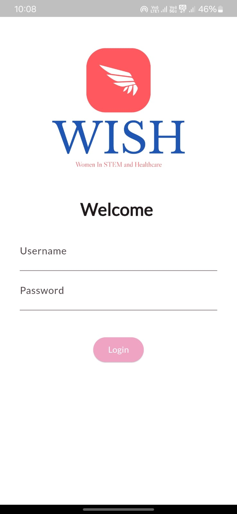
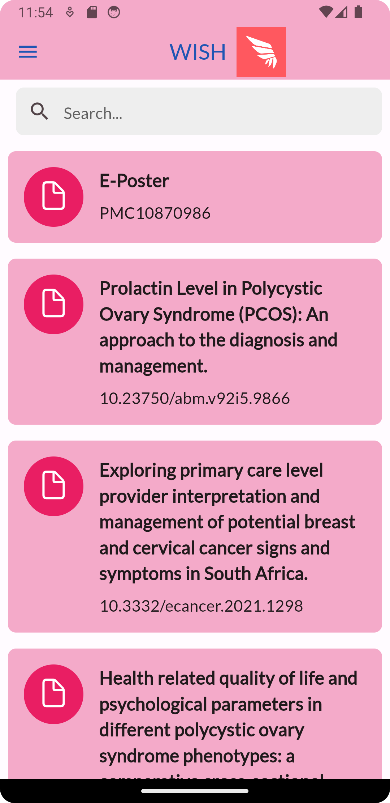
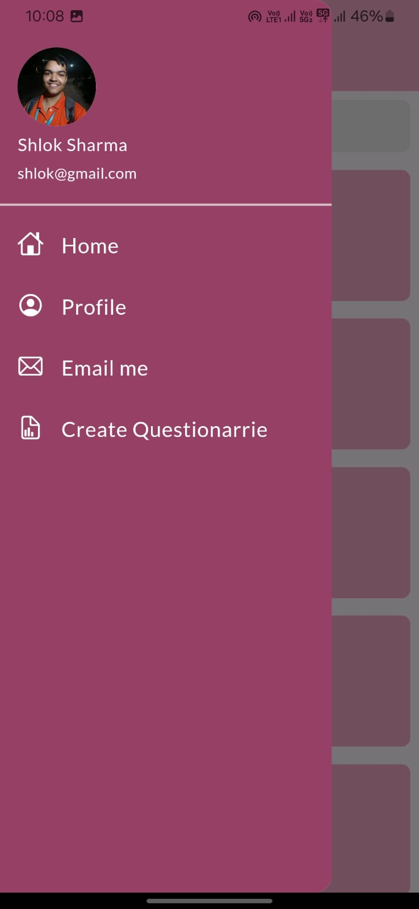
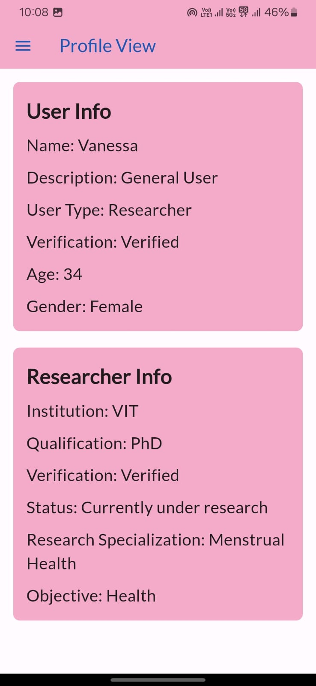

# WISH (Women in STEM and Healthcare)

<p align="center">

</p>

## About

WISH (Women in STEM and Healthcare) is a pioneering app designed to:
- **Empower women in STEM and healthcare** by spotlighting their contributions.
- Serve as a **hub for accessing and discussing research papers** authored by women.
- Enable **direct engagement with verified researchers and medical professionals** through intuitive chat and consultation features.

Our goal is to **inspire and empower the next generation** of women in STEM and healthcare, providing a platform for visibility, collaboration, and knowledge exchange.

---

## Features 🎯

### 🔐 Secure Authentication
- **Firebase & Google Auth:** Ensures robust and real-time user authentication.
- **pyTesseract for OCR:** Validates user identity, creating a safe and secure environment for women.

### 🧠 AI-Powered Insights
- **Google Gemini API:** Provides concise summaries of displayed research papers for easy understanding.

### 🌐 Multilingual Support
- **FastAPI:** Supports translation of health documents to overcome language barriers.

### 🔒 Advanced Data Security
- **Symmetric Key Encryption:** Protects sensitive user data with end-to-end encryption.
- **Secure Key Management:** Ensures secret keys are safely stored, preventing unauthorized access.

### 📄 Intuitive User Interface
- **Profile Management:** Displays user credentials and details that are publicly visible.
- **Trending Research Papers:** Highlights popular and impactful studies authored by women.
- **Interactive Sidebar Navigation:** Simplifies access to all app features.

---

## Screenshots 🖼️

### Login Page  
<br>
- Log in with the credentials used during sign-up.

### Home Page  
<br>
- Discover trending research papers and search through them.

### Sidebar  
<br>
- Access all the app features through an easy-to-use sidebar.

### Profile Page  
<br>
- View public details and credentials of the user.

---

## Demo Video 🎥

[Watch Our Demo on YouTube](https://www.youtube.com/watch?v=vbWuN2zDp7A)

---

## Installation 🛠️

### Prerequisites  

1. Ensure you have the following installed:  
   ```
   1. Flutter  
   2. Gemini API key  
   3. Firebase API key  
   ```

### Steps to Set Up  

1. **Clone the Repository**  
   ```bash
   git clone https://github.com/Death-Raider/WISH.git
   ```

2. **Start the Frontend**  
   ```bash
   cd wish
   flutter run
   ```

3. **Set Up the Backend**  
   ```bash
   cd ../api
   pip install -r requirements.txt
   python app.py
   ```

4. **Ready to Go!** 🎉

---

## Core Technologies ⚙️

- **Flutter**: Cross-platform app development framework.
- **Firebase**: User authentication and database management.
- **Google Gemini API**: For generating concise research summaries.
- **FastAPI**: Backend framework for multilingual document translation.
- **pyTesseract**: OCR for verifying user identity.
- **Python**: Backend scripting and encryption.

---

## Contributing 🤝

We welcome contributions to enhance WISH!  
To contribute:  
1. Fork the repository.  
2. Create a new branch.  
3. Commit your changes and open a pull request.

---

## License 📜

This project is licensed under the [MIT License](./LICENSE).  

---

## Acknowledgments 💡

- Inspired by the mission to **promote women in STEM and healthcare**.  
- Special thanks to the open-source community for tools and resources that made WISH possible.